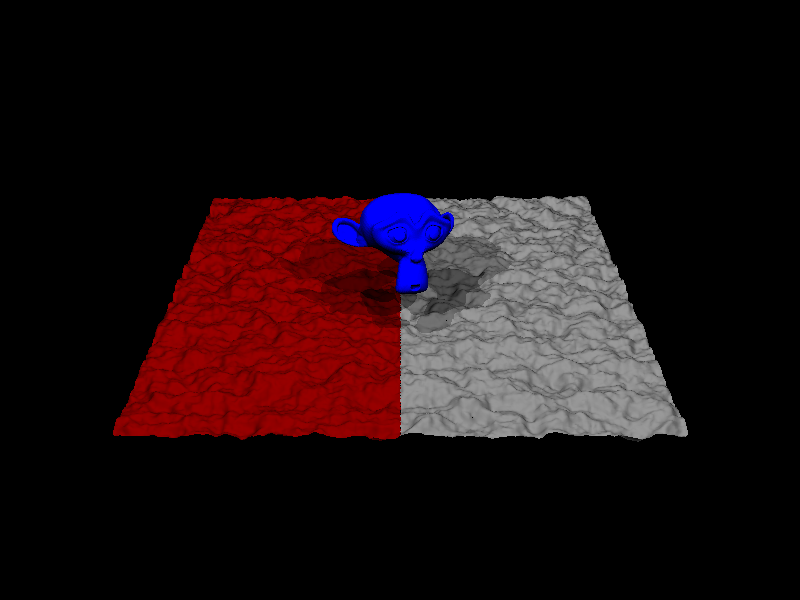

# Basic Raytracer in CUDA

*CUDA Raytracer* is a University project to implement a basic Raytracer in CUDA.
It is supplementary to the lecture on the architecture of parallel computers and gpus from Prof. Froitzheim at the TU Bergakademie Freiberg.



## Installation

First, install dependenices! (CMake, Cuda + Thrust, OpenGL, libPNG), see below for
packages in ubuntu.

```bash
git clone --recursive https://github.com/JonasToth/cuda_raytracer.git
cd cuda_raytracer && mkdir build && cd build
CC=gcc-5 CXX=g++-5 cmake .. 
make raytracer.x -j4 # main executable (dummy right now)
make all -j4 # all tests, demos and benchmarks, RECOMMENDED
# Sometimes compiling cuda binaries requires two make calls!
cd test && ctest -j4 # runs all tests
```

Benchmarks can be run in `build/benchmark`.
All Benchmarks with `ctest -j4` or each executable individually.

Demo files are in the `test/` subdirectory, e.g. `test/demo_render_materials.x`

## Platform

This project is developed and tested on the following platform. Other platforms might work but are not tested.

- Ryzen R7 1700X
- GTX 1070
- ubuntu 17.04
- CUDA 8
- gcc 5.4

## Dependencies

Dependencies exist to common libraries and SDKs.

- CUDA 8 SDK  
  https://developer.nvidia.com/cuda-downloads
- GLFW http://www.glfw.org/
  `sudo apt-get install libglfw3-dev`
- libPNG
  `sudo apt-get install libpng-dev`
- ImageMagick suite for automated testing (integration tests)
